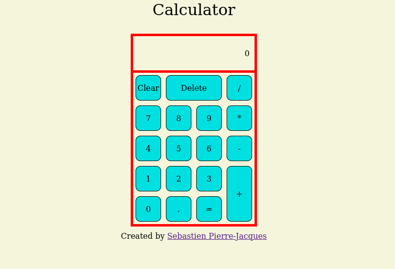

# calculator

Here is my solution to the Calculator project fron The Odin project.

This app will allow the user to make simple mathematical operations. 

I used HTML, CSS/Flexbox, and Javascript to complete this project.

Topics learned/reinforced:
- Importance of project planning
- DOM Manipulation:
  - Selecting elements using Javascript
  - Adding and removing content from page 
  - Adding Event Listeners to DOM elements
- Code Organization
- Flexbox properties
- Arrow functions

